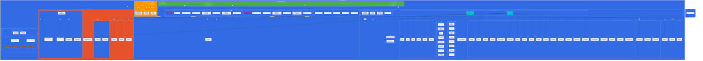

```mermaid
graph TB
    subgraph Internet["Internet"]
        CF[Cloudflare CDN/Tunnel]
    end

    subgraph Network["Network - 192.168.10.0/24"]
        direction TB
        Router["Router/Gateway<br/>192.168.10.1"]

        subgraph NAS["Synology NAS - 192.168.10.3"]
            NFS_Cluster["/volume1/cluster<br/>(app configs, registries, DBs)"]
            NFS_Media["/volume1 & /volume2<br/>(movies, tv, music, photos, books)"]
            NFS_Downloads["/volume1/downloads<br/>(torrents, usenet)"]
        end

        subgraph PiHoleDNS["Pi-hole DNS + Registry Mirrors"]
            subgraph Cerritos["cerritos - 192.168.10.80"]
                PH1[Pi-hole Primary]
                UniFi[UniFi Controller]
                REG1_DH["registry:2 :5000 - docker.io"]
                REG1_GH["registry:2 :5001 - ghcr.io"]
                REG1_K8S["registry:2 :5002 - registry.k8s.io"]
                REG1_GCR["registry:2 :5003 - gcr.io"]
                REG1_ECR["registry:2 :5004 - public.ecr.aws"]
                REG1_Q["registry:2 :5005 - quay.io"]
            end
            subgraph Excelsior["excelsior - 192.168.10.79"]
                PH2[Pi-hole Secondary]
                REG2_DH["registry:2 :5000 - docker.io"]
                REG2_GH["registry:2 :5001 - ghcr.io"]
                REG2_K8S["registry:2 :5002 - registry.k8s.io"]
                REG2_GCR["registry:2 :5003 - gcr.io"]
                REG2_ECR["registry:2 :5004 - public.ecr.aws"]
                REG2_Q["registry:2 :5005 - quay.io"]
            end
        end

        subgraph Calypso["calypso - 192.168.10.10"]
            Nginx["Nginx Reverse Proxy<br/>*.local.kalde.in"]
            Plex["Plex Media Server<br/>(HW transcoding)"]
            Transmission["Transmission<br/>Torrent Client"]
            Certbot["Certbot<br/>Let's Encrypt"]
        end

        subgraph ProxmoxCluster["Proxmox Cluster 'khaos' (5 nodes)"]
            PVE1["pve1 - 192.168.10.11"]
            PVE2["pve2 - 192.168.10.9"]
            PVE3["pve3 - 192.168.10.12"]
            PVE4["pve4 - 192.168.10.13"]
            PVE5["pve5 - 192.168.10.8"]
        end

        subgraph MainCluster["Main Kubernetes Cluster - Talos v1.12.0"]
            direction TB
            VIP_MAIN["API VIP: 192.168.10.254:6443"]

            subgraph ControlPlane["Control Plane (amd64 VMs)"]
                CP1["k8s-cp-1<br/>192.168.10.33"]
                CP2["k8s-cp-2<br/>192.168.10.44"]
                CP3["k8s-cp-3<br/>192.168.10.4"]
            end

            subgraph Workers["Workers (arm64 Raspberry Pi)"]
                PI1["k8s-pi-1<br/>192.168.10.71"]
                PI2["k8s-pi-2<br/>192.168.10.72"]
                PI3["k8s-pi-3<br/>192.168.10.73"]
                PI4["k8s-pi-4<br/>192.168.10.74"]
                PI5["k8s-pi-5<br/>192.168.10.75"]
                PI6["k8s-pi-6<br/>192.168.10.76"]
                PI7["k8s-pi-7<br/>192.168.10.77"]
                PI8["k8s-pi-8<br/>192.168.10.78"]
            end

            subgraph MainInfra["Infrastructure"]
                Cilium["Cilium CNI<br/>(eBPF, DSR, L2)"]
                Spegel["Spegel<br/>P2P Image Cache"]
                Flux_Main["Flux CD<br/>GitOps"]
                CertMgr["cert-manager<br/>Let's Encrypt"]
                Longhorn["Longhorn<br/>Distributed Storage"]
                SeaweedFS["SeaweedFS<br/>S3-compatible"]
                ExtSecrets["External Secrets<br/>1Password"]
                CNPG_Op["CNPG Operator"]
            end

            subgraph MainGateways["Gateways"]
                GW_EXT["External Gateway<br/>192.168.10.251"]
                GW_INT["Internal Gateway<br/>192.168.10.252"]
                GW_DNS["k8s-gateway DNS<br/>192.168.10.253"]
            end

            subgraph MainDBs["Databases (CNPG)"]
                PG17["postgres17<br/>3 instances, HA<br/>600 max_conn"]
                PG_Immich["immich postgres<br/>3 instances, HA<br/>pgvector/vectorchord"]
            end

            subgraph MainApps["Applications"]
                direction TB
                Immich["Immich<br/>photos.kalde.in"]
                Nextcloud["Nextcloud<br/>nc.kalde.in"]
                OpenCloud["OpenCloud<br/>cloud.kalde.in"]
                Collabora["Collabora<br/>office.kalde.in"]
                HA["Home Assistant<br/>home-assistant.kalde.in"]
                Paperless["Paperless-ngx<br/>documents.kalde.in"]
                Miniflux["Miniflux<br/>rss.kalde.in"]
                Teslamate["Teslamate<br/>tesla.kalde.in"]
                N8N["n8n<br/>n8n.kalde.in"]
                Mealie["Mealie<br/>mealie.kalde.in"]
                Wallabag["Wallabag<br/>walla.kalde.in"]
                Linkding["Linkding<br/>linkding.kalde.in"]
                Kavita["Kavita<br/>kavita.kalde.in"]
                Kapowarr["Kapowarr<br/>kapowarr.kalde.in"]
                FileBrowser["FileBrowser<br/>filebrowser.kalde.in"]
                Peppermint["Peppermint<br/>peppermint.kalde.in"]
                ChangeDetect["ChangeDetection<br/>changedetection.kalde.in"]
                ConsoleWiki["ConsoleWiki<br/>consolewiki.kalde.in"]
                Kometa["Kometa<br/>Media Manager"]
                DailyTrace["DailyTrace<br/>dailytrace.kalde.in"]
                InvoiceNinja["InvoiceNinja<br/>invoiceninja namespace"]
            end

            subgraph MediaApps["Media Stack (media namespace)"]
                Radarr["Radarr<br/>Movies"]
                Sonarr["Sonarr<br/>TV"]
                Lidarr["Lidarr<br/>Music"]
                Sabnzbd["Sabnzbd<br/>Usenet"]
                Seerr["Jellyseerr<br/>Requests"]
                Tautulli["Tautulli<br/>Plex Monitor"]
            end

            subgraph MainMon["Monitoring"]
                Prom_Main["Prometheus<br/>14d retention, 50Gi"]
                Promtail_Main["Promtail<br/>Log Shipper"]
                NodeExp["Node Exporter<br/>DaemonSet"]
                KSM["Kube State Metrics"]
            end

            subgraph CICD["CI/CD"]
                ARC["Actions Runner Controller"]
                Runners["GitHub Runners<br/>(khaoslabs, beoftexas)"]
            end
        end

        subgraph ObsCluster["Observability Cluster - Talos v1.11.5"]
            direction TB
            VIP_OBS["API VIP: 192.168.10.244:6443"]

            subgraph ObsNodes["Nodes (3x amd64 VMs, 4 vCPU, 8GB each)"]
                OBS1["obs-cp-1<br/>192.168.10.47"]
                OBS2["obs-cp-2<br/>192.168.10.48"]
                OBS3["obs-cp-3<br/>192.168.10.49"]
            end

            subgraph ObsGateways["Gateways"]
                OBS_GW_EXT["External<br/>192.168.10.241"]
                OBS_GW_INT["Internal<br/>192.168.10.242"]
            end

            subgraph ObsApps["Observability Stack"]
                Prom_Obs["Prometheus<br/>90d retention, 500Gi<br/>prometheus-obs.kalde.in"]
                Loki["Loki<br/>90d retention, 200Gi<br/>loki-obs.kalde.in"]
                Grafana["Grafana<br/>grafana-obs.kalde.in"]
                AlertMgr["Alertmanager<br/>(Discord webhook)"]
                UptimeKuma["Uptime Kuma<br/>uptime-obs.kalde.in"]
            end
        end

        subgraph DockerHosts["Standalone Docker Hosts"]
            subgraph GameServers["Game Servers"]
                VM_PVE2["pve2-ubuntu-highmem-1<br/>192.168.10.41"]
                Valheim1["Valhammer :2456"]
                Valheim2["Breastia :2556"]
                Valheim3["Warheimer :2656"]
                VM_PVE5["pve5-ubuntu-highmem-1<br/>192.168.10.50"]
                Minecraft["Minecraft :25565"]
            end
            subgraph DevHosts["Dev/Other"]
                VM_PVE1["pve1-ubuntu-1<br/>192.168.10.35"]
                Beoftexas["Beoftexas App<br/>+ MariaDB"]
            end
        end
    end

    %% Internet connections
    CF -->|"Tunnel"| GW_EXT
    CF -->|"Tunnel"| OBS_GW_EXT

    %% DNS
    PH1 & PH2 -.->|"DNS"| Router

    %% Registry mirrors serve both clusters
    REG1_DH & REG2_DH -.->|"Pull-through cache"| MainCluster
    REG1_DH & REG2_DH -.->|"Pull-through cache"| ObsCluster

    %% NAS connections
    NFS_Cluster -->|"NFS"| MainCluster
    NFS_Cluster -->|"NFS"| ObsCluster
    NFS_Cluster -->|"NFS"| Cerritos
    NFS_Cluster -->|"NFS"| Excelsior
    NFS_Media -->|"NFS"| Plex
    NFS_Media -->|"NFS"| MainCluster
    NFS_Downloads -->|"NFS"| Transmission

    %% Prometheus federation
    Prom_Main -->|"Federation<br/>/federate"| Prom_Obs
    Promtail_Main -->|"Logs"| Loki

    %% Database connections
    PG17 --- Miniflux & Teslamate & Paperless & N8N & Mealie & Wallabag & Nextcloud & Peppermint
    PG17 --- Radarr & Sonarr & Lidarr & Seerr & Tautulli
    PG_Immich --- Immich

    %% Proxmox hosts VMs
    PVE1 -->|"VMs"| CP1
    PVE2 -->|"VMs"| CP2
    PVE1 -->|"VMs"| OBS1
    PVE2 -->|"VMs"| OBS2
    PVE3 -->|"VMs"| OBS3

    %% Nginx proxy
    Nginx -->|"proxy"| UniFi
    Nginx -->|"proxy"| PH1
    Nginx -->|"proxy"| PH2
    Nginx -->|"proxy"| ProxmoxCluster

    %% Game server hosts
    VM_PVE2 --- Valheim1 & Valheim2 & Valheim3
    VM_PVE5 --- Minecraft

    %% Grafana datasources
    Grafana -->|"query"| Prom_Obs
    Grafana -->|"query"| Loki
    Grafana -->|"query"| AlertMgr

    %% Styles
    classDef cluster fill:#326CE5,stroke:#fff,color:#fff
    classDef obs fill:#E6522C,stroke:#fff,color:#fff
    classDef nas fill:#4CAF50,stroke:#fff,color:#fff
    classDef proxy fill:#FF9800,stroke:#fff,color:#fff
    classDef dns fill:#9C27B0,stroke:#fff,color:#fff
    classDef db fill:#00BCD4,stroke:#fff,color:#fff
    classDef game fill:#795548,stroke:#fff,color:#fff

    class MainCluster,ControlPlane,Workers cluster
    class ObsCluster,ObsNodes obs
    class NAS,NFS_Cluster,NFS_Media,NFS_Downloads nas
    class Calypso,Nginx proxy
    class PH1,PH2 dns
    class PG17,PG_Immich db
    class Valheim1,Valheim2,Valheim3,Minecraft game

```
