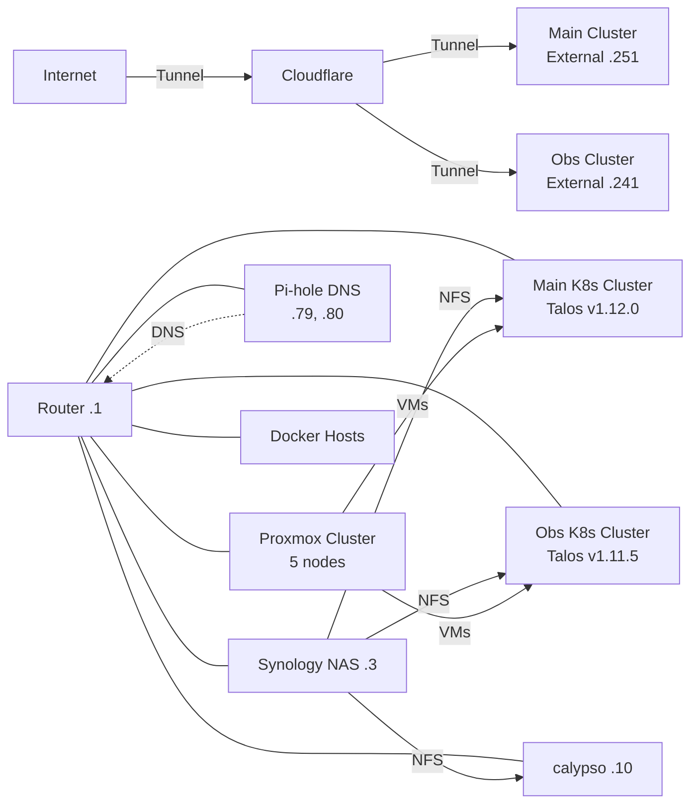
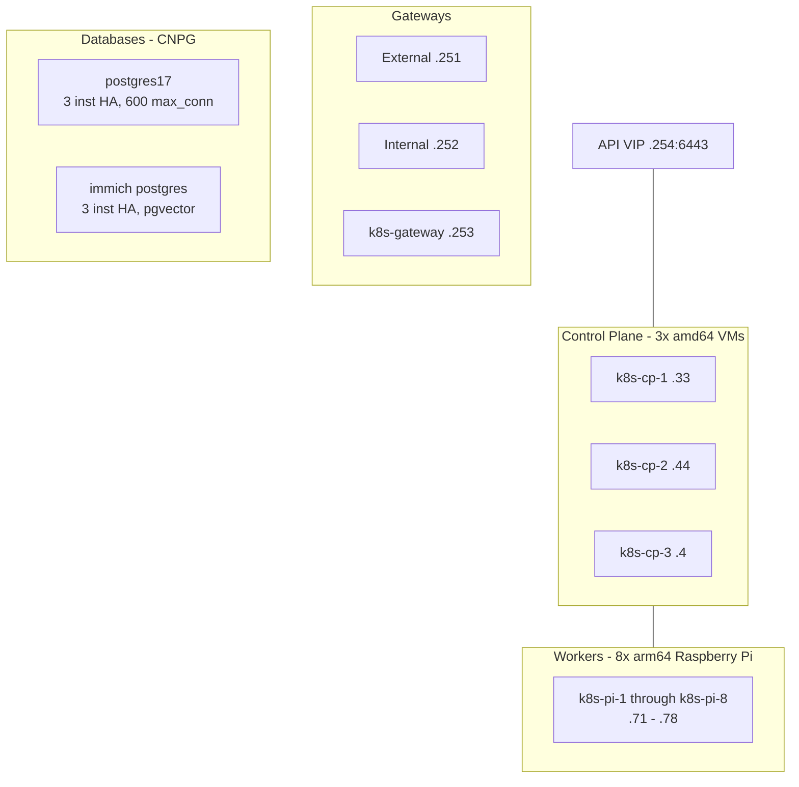
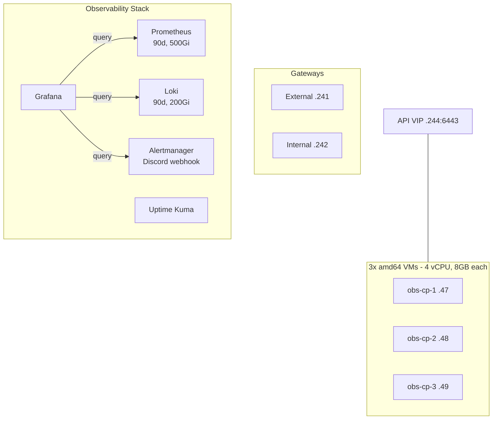
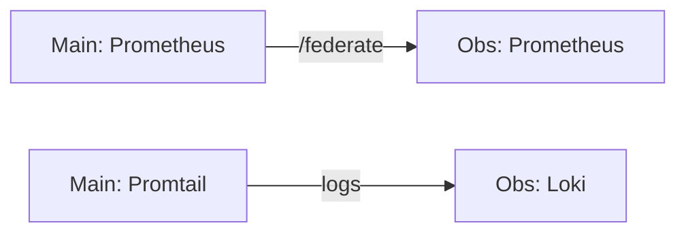

# Home Infrastructure - kalde.in

## Network Overview

All devices on `192.168.10.0/24`.

## Network Inventory

| Host | IP | Role |
|---|---|---|
| Router/Gateway | .1 | Network gateway |
| Synology NAS | .3 | NFS storage |
| calypso | .10 | Nginx proxy, Plex, Transmission |
| pve1 | .11 | Proxmox node |
| pve2 | .9 | Proxmox node |
| pve3 | .12 | Proxmox node |
| pve4 | .13 | Proxmox node |
| pve5 | .8 | Proxmox node |
| excelsior | .79 | Pi-hole Secondary, Registry mirrors |
| cerritos | .80 | Pi-hole Primary, UniFi, Registry mirrors |

## NAS Shares

| Share | Consumers | Contents |
|---|---|---|
| `/volume1/cluster` | Main cluster, Obs cluster, cerritos, excelsior | App configs, registry data, databases |
| `/volume1` & `/volume2` | Plex, Main cluster | Movies, TV, music, photos, books |
| `/volume1/downloads` | Transmission | Torrents, usenet |

## Main Kubernetes Cluster

### Infrastructure Components

| Component | Purpose |
|---|---|
| Cilium CNI | eBPF networking, DSR, L2 announcements |
| Spegel | P2P image cache |
| Flux CD | GitOps |
| cert-manager | Let's Encrypt certificates |
| Longhorn | Distributed block storage |
| SeaweedFS | S3-compatible object storage |
| External Secrets | 1Password integration |
| CNPG Operator | PostgreSQL HA operator |

### Applications

| App | URL | DB |
|---|---|---|
| Immich | photos.kalde.in | immich postgres |
| Nextcloud | nc.kalde.in | postgres17 |
| OpenCloud | cloud.kalde.in | - |
| Collabora | office.kalde.in | - |
| Home Assistant | home-assistant.kalde.in | - |
| Paperless-ngx | documents.kalde.in | postgres17 |
| Miniflux | rss.kalde.in | postgres17 |
| Teslamate | tesla.kalde.in | postgres17 |
| n8n | n8n.kalde.in | postgres17 |
| Mealie | mealie.kalde.in | postgres17 |
| Wallabag | walla.kalde.in | postgres17 |
| Linkding | linkding.kalde.in | - |
| Kavita | kavita.kalde.in | - |
| Kapowarr | kapowarr.kalde.in | - |
| FileBrowser | filebrowser.kalde.in | - |
| Peppermint | peppermint.kalde.in | postgres17 |
| ChangeDetection | changedetection.kalde.in | - |
| ConsoleWiki | consolewiki.kalde.in | - |
| Kometa | - | - |
| DailyTrace | dailytrace.kalde.in | - |
| InvoiceNinja | - | - |

### Media Stack (media namespace)

| App | Purpose | DB |
|---|---|---|
| Radarr | Movies | postgres17 |
| Sonarr | TV | postgres17 |
| Lidarr | Music | postgres17 |
| Sabnzbd | Usenet downloads | - |
| Jellyseerr | Media requests | postgres17 |
| Tautulli | Plex monitoring | postgres17 |

### Monitoring & CI/CD

| Component | Details |
|---|---|
| Prometheus | 14d retention, 50Gi |
| Promtail | Log shipper to Loki |
| Node Exporter | DaemonSet |
| Kube State Metrics | Cluster metrics |
| Actions Runner Controller | GitHub runners for khaoslabs, beoftexas |

## Observability Cluster

| Service | URL |
|---|---|
| Prometheus | prometheus-obs.kalde.in |
| Loki | loki-obs.kalde.in |
| Grafana | grafana-obs.kalde.in |
| Uptime Kuma | uptime-obs.kalde.in |

### Cross-Cluster Data Flow

## Pi-hole DNS + Registry Mirrors

| Host | IP | Roles |
|---|---|---|
| cerritos | .80 | Pi-hole Primary, UniFi Controller, Registry mirrors |
| excelsior | .79 | Pi-hole Secondary, Registry mirrors |

Each host runs pull-through cache mirrors on ports 5000-5005:

| Port | Registry |
|---|---|
| 5000 | docker.io |
| 5001 | ghcr.io |
| 5002 | registry.k8s.io |
| 5003 | gcr.io |
| 5004 | public.ecr.aws |
| 5005 | quay.io |

## Standalone Docker Hosts

| Host | IP | Services |
|---|---|---|
| pve2-ubuntu-highmem-1 | .41 | Valhammer :2456, Breastia :2556, Warheimer :2656 |
| pve5-ubuntu-highmem-1 | .50 | Minecraft :25565 |
| pve1-ubuntu-1 | .35 | Beoftexas App + MariaDB |

## calypso - 192.168.10.10

| Service | Details |
|---|---|
| Nginx | Reverse proxy for `*.local.kalde.in` (UniFi, Pi-hole, Proxmox) |
| Plex | Media server with HW transcoding |
| Transmission | Torrent client |
| Certbot | Let's Encrypt certificates |
