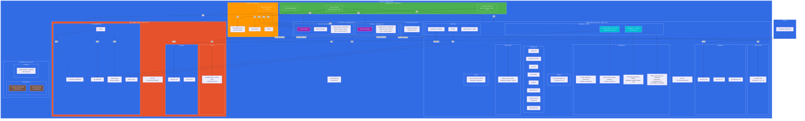

```mermaid
graph TB
    subgraph Internet["Internet"]
        CF[Cloudflare CDN/Tunnel]
    end

    subgraph Network["Network - 192.168.10.0/24"]
        direction TB
        Router["Router/Gateway<br/>192.168.10.1"]

        subgraph NAS["Synology NAS - 192.168.10.3"]
            NFS_Cluster["/volume1/cluster<br/>configs, registries, DBs"]
            NFS_Media["/volume1 & /volume2<br/>movies, tv, music, photos, books"]
            NFS_Downloads["/volume1/downloads"]
        end

        subgraph PiHoleDNS["Pi-hole DNS + Registry Mirrors"]
            subgraph Cerritos["cerritos - 192.168.10.80"]
                PH1[Pi-hole Primary]
                UniFi[UniFi Controller]
                REG1["Registry Mirrors :5000-5005<br/>docker.io, ghcr.io, k8s.io,<br/>gcr.io, ecr.aws, quay.io"]
            end
            subgraph Excelsior["excelsior - 192.168.10.79"]
                PH2[Pi-hole Secondary]
                REG2["Registry Mirrors :5000-5005<br/>docker.io, ghcr.io, k8s.io,<br/>gcr.io, ecr.aws, quay.io"]
            end
        end

        subgraph Calypso["calypso - 192.168.10.10"]
            Nginx["Nginx Reverse Proxy<br/>*.local.kalde.in"]
            Plex["Plex Media Server<br/>HW transcoding"]
            Transmission["Transmission"]
            Certbot["Certbot"]
        end

        subgraph ProxmoxCluster["Proxmox Cluster 'khaos'"]
            PVE["5 nodes: pve1-pve5<br/>192.168.10.8-13"]
        end

        subgraph MainCluster["Main Kubernetes Cluster - Talos v1.12.0"]
            direction TB
            VIP_MAIN["API VIP: 192.168.10.254:6443"]

            subgraph ControlPlane["Control Plane"]
                CP["3x amd64 VMs<br/>192.168.10.4, .33, .44"]
            end

            subgraph Workers["Workers"]
                PI["8x arm64 Raspberry Pi<br/>192.168.10.71-78"]
            end

            subgraph MainInfra["Infrastructure"]
                Cilium["Cilium CNI"]
                Spegel["Spegel P2P Cache"]
                Flux_Main["Flux CD"]
                CertMgr["cert-manager"]
                Longhorn["Longhorn"]
                SeaweedFS["SeaweedFS S3"]
                ExtSecrets["External Secrets<br/>1Password"]
                CNPG_Op["CNPG Operator"]
            end

            subgraph MainGateways["Gateways"]
                GW_EXT["External .251"]
                GW_INT["Internal .252"]
                GW_DNS["k8s-gateway .253"]
            end

            subgraph MainDBs["Databases - CNPG"]
                PG17["postgres17 - 3 inst HA<br/>600 max_conn"]
                PG_Immich["immich postgres - 3 inst HA<br/>pgvector/vectorchord"]
            end

            subgraph MainApps["Applications"]
                AppCloud["Cloud: Nextcloud, OpenCloud,<br/>Collabora, FileBrowser"]
                AppMedia["Media: Immich, Kavita, Kapowarr,<br/>Kometa, DailyTrace"]
                AppProd["Productivity: Paperless, Miniflux,<br/>Wallabag, Linkding, Mealie, n8n"]
                AppOther["Other: Home Assistant, Teslamate,<br/>Peppermint, ChangeDetection,<br/>ConsoleWiki, InvoiceNinja"]
            end

            subgraph MediaApps["Media Stack"]
                MediaArr["Radarr, Sonarr, Lidarr<br/>Sabnzbd, Jellyseerr, Tautulli"]
            end

            subgraph MainMon["Monitoring"]
                Prom_Main["Prometheus 14d/50Gi"]
                Promtail_Main["Promtail"]
                MonAgents["Node Exporter + KSM"]
            end

            subgraph CICD["CI/CD"]
                ARC["Actions Runner Controller<br/>khaoslabs, beoftexas"]
            end
        end

        subgraph ObsCluster["Observability Cluster - Talos v1.11.5"]
            direction TB
            VIP_OBS["API VIP: 192.168.10.244:6443"]

            subgraph ObsNodes["Nodes"]
                OBS["3x amd64 VMs, 4 vCPU, 8GB<br/>192.168.10.47-49"]
            end

            subgraph ObsGateways["Gateways"]
                OBS_GW_EXT["External .241"]
                OBS_GW_INT["Internal .242"]
            end

            subgraph ObsApps["Observability Stack"]
                Prom_Obs["Prometheus 90d/500Gi"]
                Loki["Loki 90d/200Gi"]
                Grafana["Grafana"]
                AlertMgr["Alertmanager<br/>Discord webhook"]
                UptimeKuma["Uptime Kuma"]
            end
        end

        subgraph DockerHosts["Standalone Docker Hosts"]
            subgraph GameServers["Game Servers"]
                Valheim["3x Valheim :2456-2656<br/>192.168.10.41"]
                Minecraft["Minecraft :25565<br/>192.168.10.50"]
            end
            subgraph DevHosts["Dev/Other"]
                Beoftexas["Beoftexas App + MariaDB<br/>192.168.10.35"]
            end
        end
    end

    %% Internet connections
    CF -->|"Tunnel"| GW_EXT
    CF -->|"Tunnel"| OBS_GW_EXT

    %% DNS
    PH1 & PH2 -.->|"DNS"| Router

    %% Registry mirrors
    REG1 & REG2 -.->|"Pull-through cache"| MainCluster
    REG1 & REG2 -.->|"Pull-through cache"| ObsCluster

    %% NAS connections
    NFS_Cluster -->|"NFS"| MainCluster
    NFS_Cluster -->|"NFS"| ObsCluster
    NFS_Cluster -->|"NFS"| Cerritos
    NFS_Cluster -->|"NFS"| Excelsior
    NFS_Media -->|"NFS"| Plex
    NFS_Media -->|"NFS"| MainCluster
    NFS_Downloads -->|"NFS"| Transmission

    %% Proxmox hosts VMs
    PVE -->|"VMs"| CP
    PVE -->|"VMs"| OBS

    %% Prometheus federation
    Prom_Main -->|"Federation"| Prom_Obs
    Promtail_Main -->|"Logs"| Loki

    %% Database connections
    PG17 --- AppProd & AppOther & MediaArr
    PG_Immich --- AppMedia

    %% Nginx proxy
    Nginx -->|"proxy"| UniFi
    Nginx -->|"proxy"| PH1 & PH2
    Nginx -->|"proxy"| ProxmoxCluster

    %% Grafana datasources
    Grafana -->|"query"| Prom_Obs & Loki & AlertMgr

    %% Styles
    classDef cluster fill:#326CE5,stroke:#fff,color:#fff
    classDef obs fill:#E6522C,stroke:#fff,color:#fff
    classDef nas fill:#4CAF50,stroke:#fff,color:#fff
    classDef proxy fill:#FF9800,stroke:#fff,color:#fff
    classDef dns fill:#9C27B0,stroke:#fff,color:#fff
    classDef db fill:#00BCD4,stroke:#fff,color:#fff
    classDef game fill:#795548,stroke:#fff,color:#fff

    class MainCluster,ControlPlane,Workers cluster
    class ObsCluster,ObsNodes obs
    class NAS,NFS_Cluster,NFS_Media,NFS_Downloads nas
    class Calypso,Nginx proxy
    class PH1,PH2 dns
    class PG17,PG_Immich db
    class Valheim,Minecraft game
```
